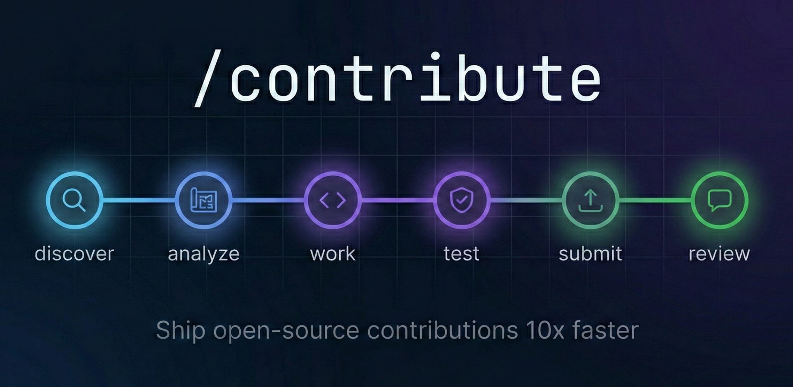

<div align="center">



<br/>

[](LICENSE)
[](https://github.com/LuciferDono/contribute/stargazers)
[](https://github.com/LuciferDono/contribute/issues)
[](https://docs.anthropic.com/en/docs/claude-code)

**Full-lifecycle open-source contribution workflow.**
Find issues. Analyze repos. Write code. Validate with industrial-grade testing. Submit PRs. Respond to reviews.

One command. Every phase.

[Installation](#installation) | [Quick Start](#quick-start) | [All Phases](#phases) | [Cross-Tool Support](#cross-tool-compatibility)

</div>

---

## Why?

Contributing to open source is high-friction:

- Finding the *right* issue takes hours of browsing
- Understanding a new codebase takes days
- Matching upstream conventions means reading scattered docs
- Submitting a quality PR means running tests, linters, security checks manually
- Responding to review feedback is another context switch

**This plugin turns the entire process into a guided, 11-phase workflow.** One command per phase. Built-in safety rails. Industrial-grade testing with an 85% quality gate before you can submit.

---

## Installation

```bash
claude plugin add LuciferDono/contribute
```

**Requirements:**
- [Claude Code](https://docs.anthropic.com/en/docs/claude-code) (primary) -- also works with Cursor, Antigravity, and other AI coding tools
- [GitHub CLI](https://cli.github.com/) (`gh`) -- authenticated
- Git -- configured with `user.name` and `user.email`

---

## Quick Start

```bash
# Find an issue to work on
/contribute discover

# Analyze the repo and plan your approach
/contribute analyze https://github.com/owner/repo/issues/123

# Write the code (choose your mode: do / guide / adaptive)
/contribute work

# Validate with 5-stage testing (must score 85%+)
/contribute test

# Push and open PR
/contribute submit

# Monitor feedback and iterate
/contribute review
```

Or just type `/contribute` -- it auto-detects the right phase from your current context.

---

## How It Works

```
/contribute discover ──> analyze ──> work ──> test ──> submit ──> review
                                                │
                                           sync (anytime)
                                           cleanup (anytime)
                                           triage (standalone)
                                           pr-review (standalone)
                                           release (standalone)
```

### Three Operating Modes

Choose how much the AI does:

| Mode | AI Does | You Do |
|------|---------|--------|
| **do** | Everything -- code, tests, formatting, validation | Review diffs, approve write operations |
| **guide** | Explain each step, provide snippets and commands | Execute the commands, write the code |
| **adaptive** | Boilerplate, scaffolding, mechanical work | Logic, design decisions, algorithmic choices |

---

## Phases

### Core Workflow

| # | Phase | Command | What It Does |
|---|-------|---------|-------------|
| 1 | **Discover** | `/contribute discover` | Search GitHub for issues matching your skills. Parallel searches with quality scoring. Verifies issues aren't already taken. |
| 2 | **Analyze** | `/contribute analyze URL` | Clone repo, read CONTRIBUTING.md, trace code paths, produce a structured contribution brief with files to modify and recommended approach. |
| 3 | **Work** | `/contribute work` | Implement the change. TDD-first. Match upstream style exactly. Minimal, focused changes only. |
| 4 | **Test** | `/contribute test` | 5-stage industrial validation: upstream tests, static analysis, security audit, functional verification, AI deep review. **Must score 85%+ to unlock submit.** |
| 5 | **Submit** | `/contribute submit` | Rebase on upstream, push to fork, draft PR following project conventions, open after your approval. |
| 6 | **Review** | `/contribute review` | Check CI status, summarize maintainer feedback, iterate on requested changes, draft responses. |

### Standalone Phases

| Phase | Command | What It Does |
|-------|---------|-------------|
| **PR Review** | `/contribute pr-review URL` | Review someone else's PR: correctness, style, tests, security, performance. Structured severity ratings. |
| **Release** | `/contribute release` | Create GitHub releases with proper tags, semver bumps, and generated changelogs. |
| **Triage** | `/contribute triage URL` | Reproduce bugs, categorize issues, check duplicates, draft response comments. |
| **Sync** | `/contribute sync` | Keep fork in sync with upstream via rebase or merge. Handle conflicts interactively. |
| **Cleanup** | `/contribute cleanup` | Remove state files, branches, close stale PRs. Supports `--dry-run` and `--full`. |

---

## The Test Gate

The test phase is the quality gatekeeper. Your contribution must pass **5 stages** and score **85% or higher** before you can submit:

```
============================================
  CONTRIBUTION TEST REPORT
============================================

Stage 1 -- Upstream Tests
  [PASS]  142/142 tests passed (0 regressions)
  [PASS]  3 new tests added
  [PASS]  Coverage: 87%

Stage 2 -- Code Quality
  [PASS]  Linter: clean
  [PASS]  Type checker: clean
  [PASS]  Formatter: clean

Stage 3 -- Security
  [PASS]  Dependency audit: clean
  [PASS]  Secret detection: clean
  [PASS]  Input validation: verified

Stage 4 -- Functional
  [PASS]  Clean build: success
  [PASS]  Edge cases: verified

Stage 5 -- AI Deep Review
  [PASS]  Correctness
  [WARN]  Readability (1 suggestion)
  [PASS]  Pushback risk

  Score: 96%  |  Status: PASS
============================================
```

**Any BLOCKER = automatic FAIL regardless of score.**

---

## Plugin Architecture

```
contribute/
├── .claude-plugin/
│   └── plugin.json              # Plugin manifest
├── agents/
│   ├── deep-reviewer.md         # AI deep review (test Stage 5)
│   └── issue-scout.md           # Parallel issue discovery
├── commands/
│   └── contribute.md            # /contribute command + auto-detection
├── skills/
│   └── contribute/
│       ├── SKILL.md             # Core rules + phase routing
│       └── references/          # 11 phase reference files
│           ├── phase-discover.md
│           ├── phase-analyze.md
│           ├── phase-work.md
│           ├── phase-test.md
│           ├── phase-submit.md
│           ├── phase-review.md
│           ├── phase-pr-review.md
│           ├── phase-release.md
│           ├── phase-triage.md
│           ├── phase-sync.md
│           └── phase-cleanup.md
├── .gitignore
├── LICENSE
└── README.md
```

| Component | Purpose |
|-----------|---------|
| **Skill** | Core rules (read/write permissions, upstream conventions, operating modes) and phase routing table. Progressive disclosure -- phase details load on demand. |
| **Command** | `/contribute` entry point. Owns argument parsing, phase routing, and auto-detection. |
| **deep-reviewer** | Isolated Opus agent for test Stage 5. Gets diff + issue + brief. Returns structured severity ratings. |
| **issue-scout** | Isolated Opus agent for discover phase. Runs parallel `gh search` queries, applies Rule 6, scores quality signals. |

---

## Safety Rules

Six non-negotiable rules govern every action:

| # | Rule | Why |
|---|------|-----|
| 1 | **Read is free, write requires permission** | Every fork, branch, commit, push, and comment requires your explicit approval. Nothing happens without your say-so. |
| 2 | **No AI attribution** | Every commit appears as sole-authored by you. Zero AI trailers. Zero exceptions. |
| 3 | **Three operating modes** | You choose how much autonomy the AI gets: do, guide, or adaptive. |
| 4 | **Respect upstream conventions** | Matches the project's style exactly. Tabs, naming, commit format -- all mirrored from the target repo. |
| 5 | **Opus only** | Both agents run on Claude Opus for maximum quality. No shortcuts. |
| 6 | **Verify issue is not taken** | Checks assignees, open PRs, comment claims, and linked PRs before recommending any issue. Never creates duplicate work. |

---

## State Files

All contribution state persists in `.claude/` across sessions:

| File | Written By | Read By | Contents |
|------|-----------|---------|----------|
| `contribute-conventions.md` | analyze | work, test, submit, review, sync, cleanup | Repo, issue, branch, mode, full conventions |
| `contribute-test-report.md` | test | submit | Scored test report (85% gate) |
| `contribute-discover.md` | discover | analyze | Issue shortlist with quality scores |
| `contribute-release-notes.md` | release | release | Draft release notes |
| `contribute-pr-body.md` | submit | submit | PR body content |

---

## Cross-Tool Compatibility

Built for **Claude Code**, but the skill content is pure markdown. Other AI coding tools can use it too.

| Feature | Claude Code | Cursor / Antigravity / Others |
|---------|-------------|-------------------------------|
| Phase instructions | Via `/contribute` command | Read `SKILL.md` + references directly |
| Core rules | Enforced by skill | Enforced by skill |
| State files | `.claude/` directory | `.claude/` directory |
| GitHub CLI commands | Works | Works |
| deep-reviewer agent | Isolated subagent | Inline review |
| issue-scout agent | Isolated subagent | Inline search |
| Auto-detection | Built into command | Manual phase selection |

---

## Contributing

Contributions welcome. This plugin follows its own workflow -- use `/contribute analyze` on this repo to get started.

## License

[MIT](LICENSE)
